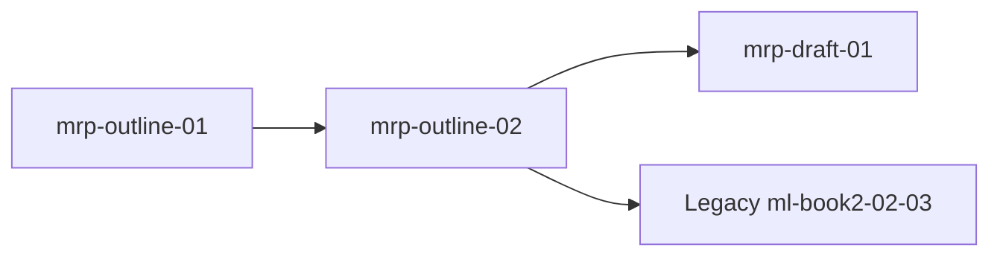

# Magicborn: The Rune Path — Roadmap

Phases mirror the [task registry](/docs/books/magicborn-rune-path/planning/task-registry).

## Phase map

| Phase id | Intent | Definition of done (summary) |
| --- | --- | --- |
| `mrp-outline-01` | Repo + Ch1 seed; timeline locks; Act I beat sheet post–Ch1; carved-rune rules promoted | [Decisions](/docs/books/magicborn-rune-path/planning/decisions) show `MRP-TIMELINE`, `MRP-SERIES-POSITION`; Act I beats on [state](/docs/books/magicborn-rune-path/planning/state) |
| `mrp-outline-02` | **Inter-book continuity** — prequel end-state, gap years, optional in-world fragments | Joint satisfaction with [Legacy](/docs/books/mordreds-legacy/planning/task-registry) `ml-book2-02-03` where applicable |
| `mrp-draft-01` | Manuscript Ch2+; Act II border-crossing milestone | `pnpm run build:books`; registry milestones |

## Dependency sketch

## Cross-links

| Record | Path |
| --- | --- |
| Story pointer + act shape | [State](/docs/books/magicborn-rune-path/planning/state) |
| Executable tasks | [Task registry](/docs/books/magicborn-rune-path/planning/task-registry) |
| Locked canon (`MRP-*`) | [Decisions](/docs/books/magicborn-rune-path/planning/decisions) |
| Book 2 anchor | [Mordred's Legacy — State](/docs/books/mordreds-legacy/planning/state) |
| Fiction agent loop | `content/docs/books/magicborn-rune-path/planning/AGENTS.md` |
