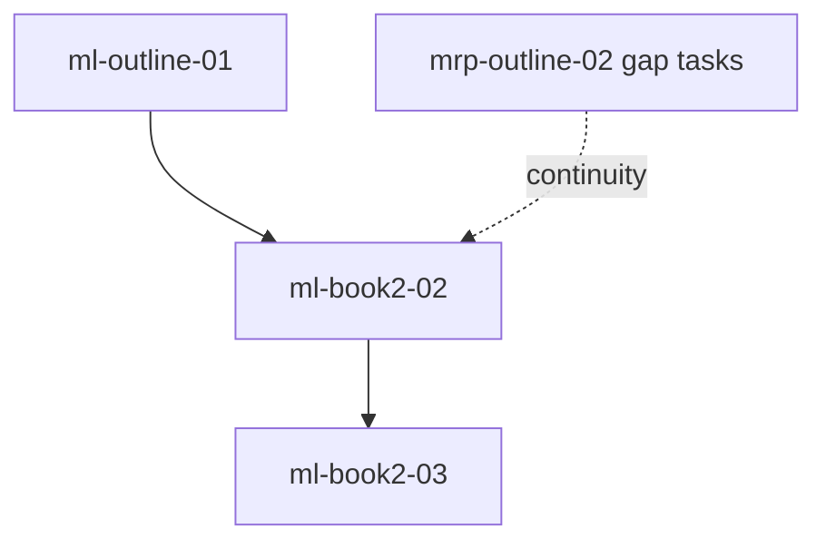

# Mordred's Legacy — Roadmap

Phases mirror the [task registry](/docs/books/mordreds-legacy/planning/task-registry). Executable rows and verification commands live there.

## Phase map

| Phase id | Intent | Definition of done (summary) |
| --- | --- | --- |
| `ml-outline-01` | Ch1 + plumbing; optional Act I polish; name parents; confirm Kael rank | Ch1 stable on [state](/docs/books/mordreds-legacy/planning/state); decisions aligned |
| `ml-book2-02` | Book 2 **body outline** — Acts II–III beat sheets, POV stickiness, cross-book alignment with [Rune Path](/docs/books/magicborn-rune-path/planning/state) | Act II + III rows on state; [`ml-book2-02-03`](/docs/books/mordreds-legacy/planning/task-registry) satisfied with prequel end-state |
| `ml-book2-03` | **Manuscript** after outline — Ch2+ draft milestones | `pnpm run build:books`; read-aloud / checklist per registry |

## Dependency sketch

## Cross-links

| Record | Path |
| --- | --- |
| Story pointer + act scaffold | [State](/docs/books/mordreds-legacy/planning/state) |
| Executable tasks | [Task registry](/docs/books/mordreds-legacy/planning/task-registry) |
| Locked canon (`ML-*`) | [Decisions](/docs/books/mordreds-legacy/planning/decisions) |
| Kael prequel | [Magicborn: The Rune Path — State](/docs/books/magicborn-rune-path/planning/state) |
| Fiction agent loop | `content/docs/books/mordreds-legacy/planning/AGENTS.md` |
