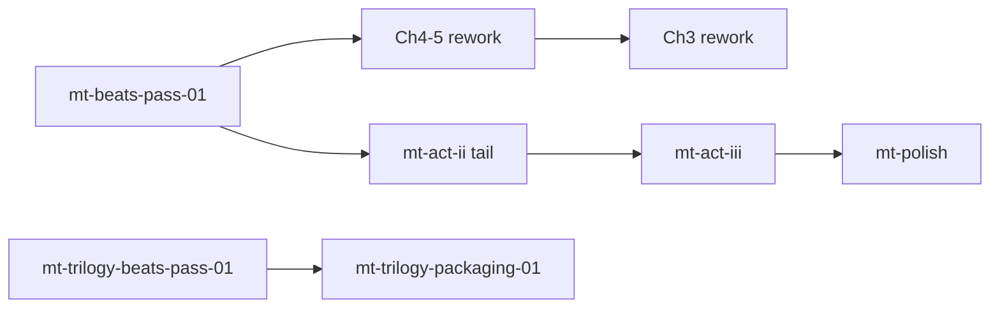

# Mordred's Tale — Roadmap

Phases mirror the [task registry](/docs/books/mordreds-tale/planning/task-registry). This page is the **sequence view**; rows with ids and verification stay on the registry.

## Phase map

| Phase id | Intent | Definition of done (summary) |
| --- | --- | --- |
| `mt-beats-pass-01` | Beat-lock **Ch6–19** before Ch3 return; moral/shock/survival notes per chapter | Each chapter row on [state](/docs/books/mordreds-tale/planning/state) has **Locked for draft**; FQ sweep in `mt-beats-01-closeout` |
| `mt-act-i` | Finish **Act I** drafting (Ch3 focus; blocked until beat pass policy satisfied) | Ch3 passes chapter checklist + handoff to Act II per registry |
| `mt-act-ii` | **Act II** chapter-at-a-time draft (full-source spine Ch4–14 as numbered on disk) | Ch14 checklist + `pnpm run build:books` when applicable |
| `mt-act-iii` | **Act III** war / coalition / carriage / epilogue lane | Act III beat map locked + Ch15–19 draft/rework gates |
| `mt-polish` | Deferred line / continuity / prose balance | After draft phases; read-through verification |
| `mt-trilogy-packaging-01` | Part I / II / III EPUB inputs from canonical `mordreds_tale` | Part folders build; manifest sane |
| `mt-trilogy-beats-pass-01` | **14-chapter Part I** map, datelines, Jack search, trilogy rhythm | Part beat rows on [state](/docs/books/mordreds-tale/planning/state); cross-links to [decisions](/docs/books/mordreds-tale/planning/decisions) |

## Dependency sketch

## Cross-links

| Record | Path |
| --- | --- |
| Story pointer + beat sheets | [State](/docs/books/mordreds-tale/planning/state) |
| Executable tasks | [Task registry](/docs/books/mordreds-tale/planning/task-registry) |
| Locked canon | [Decisions](/docs/books/mordreds-tale/planning/decisions) |
| Magicborn line (all books) | [Books section state — Magicborn line](/docs/books/planning/state#magicborn-line-world-order-and-chapter-beats) |
| Fiction agent loop | `content/docs/books/mordreds-tale/planning/AGENTS.md` |
